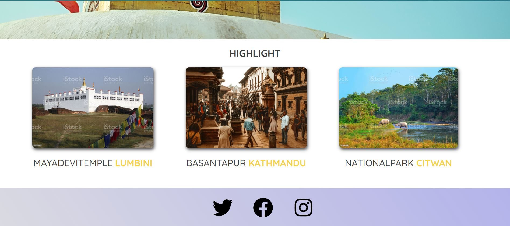
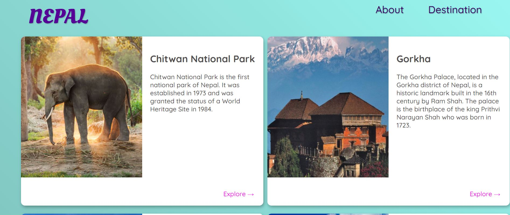

# Nepal-Tour

## Basic Website

### HTML & CSS Layout & Positioning
---

- nth type selector
```css
main li:nth-of-type(3){
  width:1220px;
  grid-column: 1 / span 2;
}

```
- position 
```css
position: absoute || relative || satic || fixed || sticky
```

- Display
```css
 display: flex || grid || block
```
- FlexBox
```css
display:flex;
flex-direction: row || column;
justify-content: center || space-between || space-around || flex-start || flex-end ;
flex-wrap: wrap || wrap-reverse; 
```
- CSS Grid 
```css
display: grid ;
grid-template-columns: 1fr 1fr || 200px 200px ;
gap: 10px(row) 20px(column);
```
- linear-gradient ( for gradient background )
```css
 background:linear-gradient(45deg,rgb(111, 162, 157),rgb(153, 246, 240));
```
- Box-Shadow
```css
box-shadow: 2px(top-bottom) 4px(left-right) 8px(radius) rgba(0,0,0,0.3);
```
- Basic Website  [preview](https://glittering-moxie-5454c4.netlify.app)
     <br><br><br>
     <br><br><br><br>
     <br><br><br><br>

